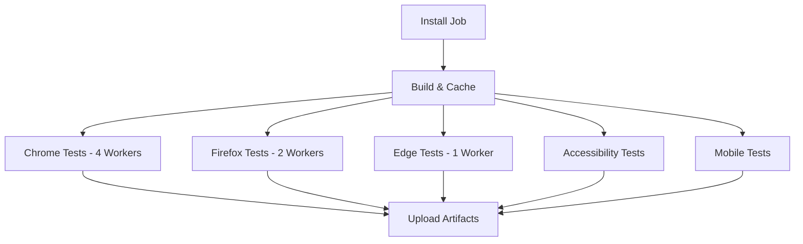

# Cypress Parallel Testing Setup

This document explains the parallel testing configuration for Cypress in your CI/CD pipeline.

## Overview

Your Cypress tests are now configured to run in parallel across multiple workers, significantly reducing test execution time. The setup includes:

- **Chrome tests**: 4 parallel workers
- **Firefox tests**: 2 parallel workers  
- **Edge tests**: Single worker (for compatibility verification)
- **Accessibility tests**: Dedicated worker
- **Mobile viewport tests**: Dedicated worker

## Architecture

### Install Job
The `install` job runs first and:
- Installs dependencies once
- Builds the application
- Caches the Cypress binary
- Uploads build artifacts for worker jobs

### Worker Jobs
Each test job:
- Downloads the pre-built application
- Installs dependencies from cache
- Runs tests in parallel using Cypress Cloud
- Uploads screenshots and videos as artifacts

## Cypress Cloud Integration

### Requirements
1. **Cypress Record Key**: Set `CYPRESS_RECORD_KEY` in your GitHub repository secrets
2. **Project ID**: Ensure `projectId` is set in `cypress.config.ts` (currently: `js5zv2`)

### Parallel Execution
Tests are distributed across workers using:
- `--record`: Records test results to Cypress Cloud
- `--parallel`: Enables parallel execution
- `--group`: Groups tests by browser/type for organization
- `--ci-build-id`: Ensures proper grouping across GitHub runs

## Available Scripts

### Local Development
```bash
# Open Cypress Test Runner
yarn cy:open

# Run tests locally
yarn cy:run

# Run tests with specific browser
yarn cy:run:chrome
yarn cy:run:firefox
yarn cy:run:edge

# Run with server (full E2E)
yarn test:e2e
yarn test:e2e:chrome
```

### Parallel Testing (requires Cypress Cloud)
```bash
# Run tests in parallel (requires CYPRESS_RECORD_KEY)
yarn cy:run:parallel

# Run parallel tests by browser
yarn cy:run:parallel:chrome
yarn cy:run:parallel:firefox

# Run specific test types
yarn cy:run:accessibility
yarn cy:run:mobile

# Full E2E parallel testing
yarn test:e2e:parallel
yarn test:e2e:parallel:chrome
yarn test:e2e:accessibility
yarn test:e2e:mobile
```

## CI/CD Workflow Structure



## Performance Benefits

### Estimated Time Savings
Based on typical Cypress test suite performance:
- **Sequential execution**: ~15-20 minutes for full test suite
- **Parallel execution**: ~4-6 minutes (70-75% reduction)

### Parallel Worker Allocation
- **Chrome (4 workers)**: Primary browser testing with maximum parallelization
- **Firefox (2 workers)**: Cross-browser compatibility verification
- **Edge (1 worker)**: Baseline compatibility check
- **Accessibility**: Dedicated testing for WCAG compliance
- **Mobile**: Viewport-specific responsive testing

## Monitoring & Debugging

### Cypress Cloud Dashboard
- View test results at: https://cloud.cypress.io/projects/js5zv2
- Monitor test duration and flaky tests
- Analyze parallel execution efficiency
- Track test trends over time

### GitHub Actions Artifacts
Each job uploads:
- Screenshots (on test failures)
- Videos (for debugging)
- Test reports
- Mochawesome HTML reports

### Debugging Failed Tests
1. Check Cypress Cloud dashboard for detailed failure logs
2. Download artifacts from GitHub Actions
3. Review screenshots and videos for visual debugging
4. Use local reproduction with specific browser

## Troubleshooting

### Common Issues

#### Tests Not Running in Parallel
- Verify `CYPRESS_RECORD_KEY` is set in GitHub secrets
- Ensure `projectId` matches your Cypress Cloud project
- Check that `--record` and `--parallel` flags are present

#### Inconsistent CI Build IDs
- All parallel jobs use the same `GITHUB_RUN_ID` for grouping
- Jobs running at different times may not group properly

#### Browser-Specific Failures
- Some tests may be flaky in specific browsers
- Use browser-specific retries or filtering
- Consider environment-specific configurations

#### Resource Constraints
- Parallel jobs require sufficient GitHub Actions runners
- Monitor execution times for worker optimization

### Recovery Strategies
1. **Retry failed jobs**: GitHub Actions allows individual job retries
2. **Fallback to sequential**: Remove `--parallel` flag for debugging
3. **Browser isolation**: Run single browser type for issue isolation

## Maintenance

### Regular Tasks
1. **Update Cypress**: Keep Cypress version current for bug fixes
2. **Monitor metrics**: Review Cypress Cloud analytics monthly
3. **Optimize workers**: Adjust parallel count based on test suite growth
4. **Clean artifacts**: Archive or remove old test artifacts

### Configuration Updates
When adding new tests:
1. Tests automatically distribute across existing workers
2. Consider increasing worker count for large test additions
3. Update browser-specific configurations as needed

### Scaling Considerations
- **Test suite growth**: Add workers as test count increases
- **New browsers**: Add dedicated worker jobs for new browser support
- **Performance regression**: Monitor execution times and adjust accordingly

## Best Practices

### Test Organization
- Group related tests in same spec file for better distribution
- Avoid test dependencies between spec files
- Use descriptive test names for better dashboard organization

### CI Optimization
- Cache dependencies aggressively
- Use artifacts for build outputs
- Minimize job startup time with proper caching

### Monitoring
- Set up alerts for test failures in Cypress Cloud
- Monitor test execution trends
- Review flaky test reports regularly

### Local Development
- Use `yarn cy:open` for interactive development
- Run specific browsers locally before CI
- Test parallel configurations with Cypress Cloud locally

## Security Notes

### Secrets Management
- `CYPRESS_RECORD_KEY` provides write access to your Cypress Cloud project
- Rotate keys periodically
- Limit key permissions to necessary scopes

### Environment Variables
- Avoid exposing sensitive data in test artifacts
- Use GitHub secrets for environment-specific configurations
- Review uploaded artifacts for sensitive information

## Next Steps

1. **Monitor Performance**: Track execution times over the next few CI runs
2. **Optimize Workers**: Adjust parallel counts based on actual test distribution
3. **Expand Coverage**: Consider adding more browser combinations if needed
4. **Set Up Alerts**: Configure notifications for test failures in Cypress Cloud
5. **Documentation**: Keep this guide updated as the test suite evolves

---

## Quick Reference

### Key Commands
```bash
# Local testing
yarn cy:open                    # Interactive test runner
yarn test:e2e                   # Full E2E test

# Parallel testing (requires Cypress Cloud)
yarn test:e2e:parallel          # All browsers in parallel
yarn cy:run:parallel:chrome     # Chrome parallel only
```

### Important Files
- `.github/workflows/e2e-tests.yml` - CI/CD configuration
- `cypress.config.ts` - Cypress configuration
- `package.json` - Test scripts and dependencies

### Resources
- [Cypress Cloud Dashboard](https://cloud.cypress.io/projects/js5zv2)
- [GitHub Actions Workflows](../../.github/workflows/)
- [Cypress Documentation](https://docs.cypress.io/)
